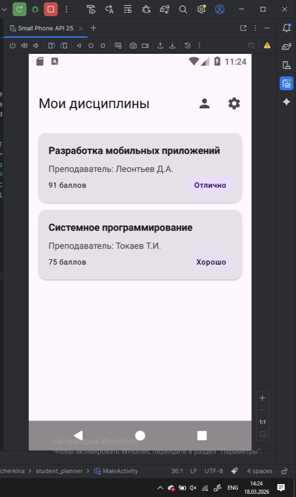
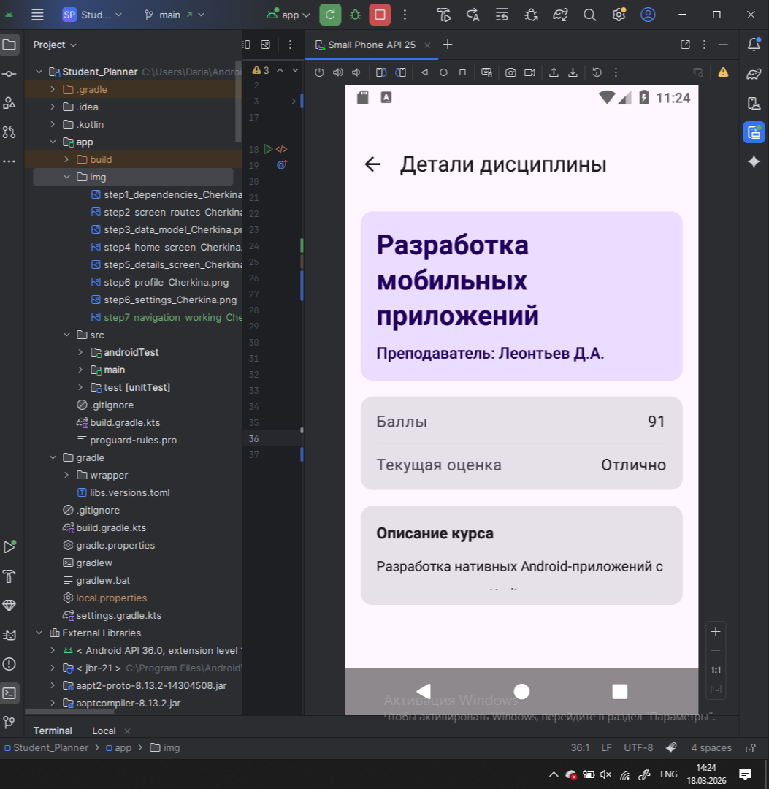
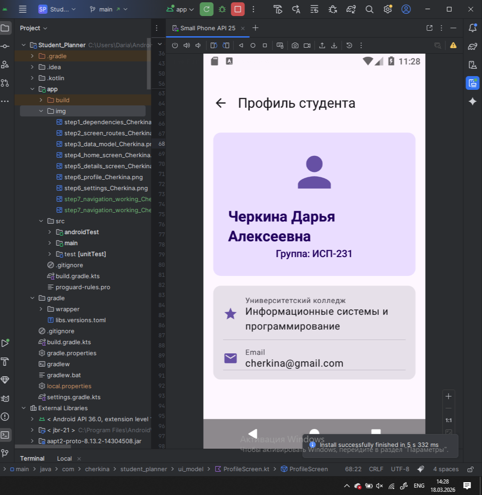
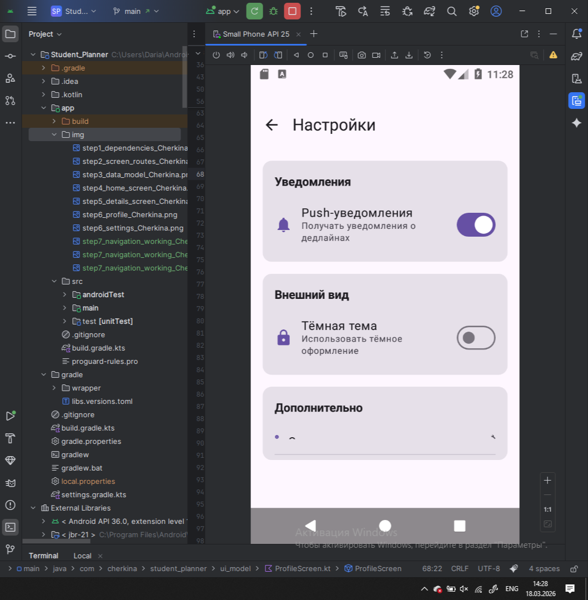

# Student Planner

## Описание

Student Planner — это учебное Android-приложение на Jetpack Compose, реализующее многоэкранную навигацию. Приложение позволяет студенту просматривать список своих дисциплин, детальную информацию по каждой из них, профиль и настройки.

## Экраны приложения

- **Home** — главный экран со списком дисциплин
- **Details** — детальная информация о выбранной дисциплине
- **Profile** — профиль студента с личными данными и статистикой
- **Settings** — настройки приложения (уведомления, тема)

## Технологии

- Kotlin
- Jetpack Compose
- Navigation Compose
- Material 3

## Схема навигации

```
Home ──── нажатие на дисциплину ──── Details
  │                                     │
  │                                   Назад
  │
  ├──── иконка Профиль ──── Profile
  │                            │
  │                          Назад
  │
  └──── иконка Настройки ──── Settings
                                  │
                                Назад
```

## Скриншоты

### Главный экран


### Детали дисциплины


### Профиль студента


### Настройки


## Контрольные вопросы

### 1. Что такое NavController и для чего он используется?

NavController — это объект, который управляет навигацией между экранами: он хранит back stack, выполняет переходы по маршрутам и возвраты назад. Создавать его нужно через `rememberNavController()`, потому что эта функция сохраняет экземпляр NavController при рекомпозиции — если создать его просто как `NavHostController(context)`, он будет пересоздаваться каждый раз при перерисовке UI, что приведёт к потере стека навигации.

### 2. Как передать параметр в маршрут навигации?

Сначала в маршруте объявляется плейсхолдер: `"details/{subjectId}"`. При навигации передаётся конкретное значение: `navController.navigate("details/123")`. На стороне экрана параметр извлекается из `backStackEntry.arguments?.getString("subjectId")`. Обязательный параметр прописывается прямо в пути (`{subjectId}`), а опциональный — через query-строку (`"search?query={query}"`) с указанием `defaultValue`, и он может отсутствовать в вызове.

### 3. Зачем использовать sealed class для маршрутов?

Sealed class даёт type-safety: компилятор знает все возможные варианты экранов и не даст обратиться к несуществующему маршруту. Например, если использовать просто строки и написать `"detailes/123"` вместо `"details/123"` — ошибка проявится только в рантайме. Со sealed class метод `Screen.Details.createRoute("123")` не позволит допустить опечатку в названии маршрута — IDE сразу укажет на ошибку.

### 4. Что такое Back Stack и как им управлять?

Back Stack — стек экранов по принципу LIFO (последним вошёл — первым вышел). Для последовательности Home -> Profile -> Settings стек выглядит так:

[ Home | Profile | Settings ]  <- текущий экран

При вызове `popBackStack()` на экране Settings он убирается из стека и отображается Profile. Back stack управляется через `navController.popBackStack()` для возврата на шаг назад или через `popUpTo()` для возврата к конкретному экрану.

### 5. Как работает startDestination в NavHost?

`startDestination` определяет, какой экран будет показан первым при запуске приложения — в нашем случае это `Screen.Home.route`. Этот экран кладётся в основание back stack. Динамически изменить `startDestination` после создания NavHost нельзя, но можно реализовать условную логику до его создания — например, если пользователь не авторизован, передать в качестве startDestination экран логина.

### 6. Что произойдёт, если навигировать на несуществующий маршрут?

NavController бросит исключение `IllegalArgumentException` с сообщением, что маршрут не найден, и приложение упадёт. Чтобы избежать этого, нужно использовать sealed class для маршрутов (тогда ошибочный маршрут просто не скомпилируется) или оборачивать навигацию в try-catch и логировать ошибку с показом fallback-экрана.

### 7. Зачем нужен параметр launchSingleTop?

Без `launchSingleTop = true` при повторном нажатии на кнопку перехода на экран, который уже является текущим, в стек добавится ещё один его экземпляр. Например, если пользователь быстро нажмёт на "Профиль" дважды — в стеке окажется два экрана Profile, и для возврата на Home придётся нажать "Назад" дважды. С `launchSingleTop = true` повторный переход на уже открытый экран игнорируется, и стек не засоряется дублями.

## Автор:

Черкина Дарья ИСП-231
